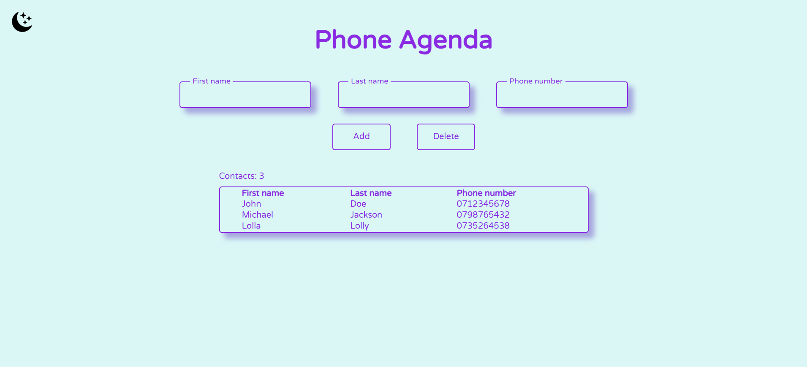
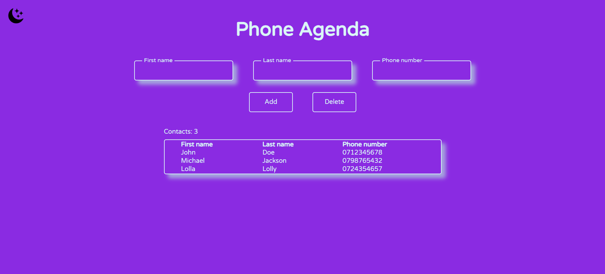

📖Phone Book

O aplicație web simplă pentru gestionarea unei agende de contacte — realizată în HTML, CSS și JavaScript pur.

Poți adăuga, șterge și vizualiza contacte, iar interfața suportă o temă deschisă și una întunecată.

🚀Funcționalități

➕ Adăugare contact (prenume, nume, telefon)

❌ Ștergere contact pe baza numelui și numărului de telefon

🔢 Contor automat al numărului total de contacte

🌙 Dark / Light Mode (comutare cu butonul din colțul stânga-sus)

⚠️ Validare date – câmpurile goale sau greșite declanșează un efect de „shake” și un mesaj de eroare

💾 Datele sunt gestionate doar în memorie (nu există stocare permanentă)

